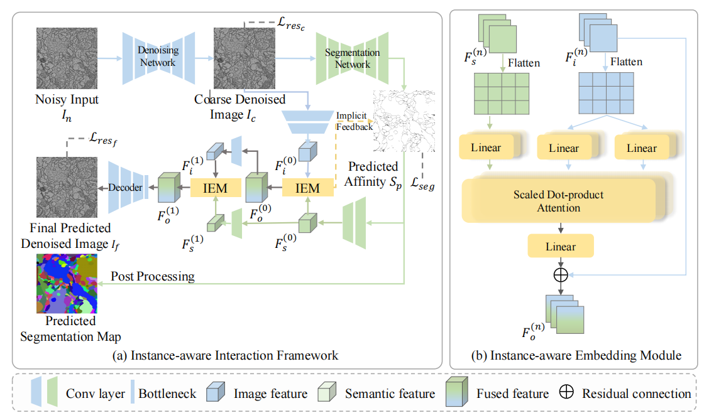

# Joint EM Image Denoising and Segmentation with Instance-aware Interaction
**Accepted by MICCAI-2024**  
Zhicheng Wang, Jiacheng Li, Yinda Chen, Jiateng Shou, Shiyu Deng, Wei Huang
, Zhiwei Xiong* 
MoE Key Laboratory of Brain-inspired Intelligent Perception and Cognition, University of Science and Technology of China  
Anhui Province Key Laboratory of Biomedical Imaging and Intelligent Processing, Institute of Artificial Intelligence, Hefei Comprehensive National Science Center    
*Corresponding Author

